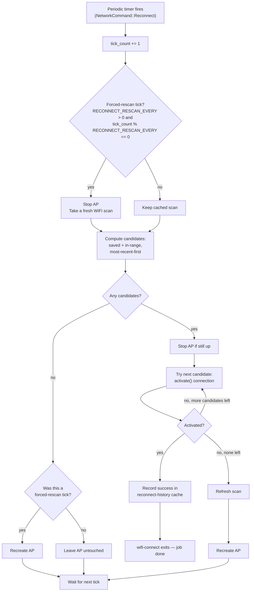

# How WiFi Connect Works

This is a deeper, end-to-end look at wifi-connect's runtime behavior, complementing the
step-by-step captive-portal walkthrough in the main [README](../README.md#how-it-works).

## Startup

1. `scripts/start.sh` runs first, before the wifi-connect binary itself.
   - It checks whether a wired (Ethernet) connection is already up (waiting a short,
     bounded time for one that's still negotiating DHCP). If so, wifi-connect is never
     launched — a wired connection is treated as "job done," the same as a successful
     WiFi connection.
   - Otherwise it falls back to the existing check: if the device already has an active
     WiFi connection (`iwgetid -r`), wifi-connect is skipped too.
   - Only if neither check finds an existing connection does it launch the wifi-connect
     binary.
   - This decision is made once, at boot. Neither `start.sh` nor the wifi-connect binary
     re-checks wired state afterward — see "Known limitations" below.
2. wifi-connect itself starts NetworkManager (if needed), finds a managed WiFi device,
   scans for visible access points, and opens the AP/captive portal (`src/network.rs`).

## While the captive portal is running

- A user can connect a phone/laptop to the AP, load the captive portal, pick an SSID and
  enter a passphrase. wifi-connect attempts that connection; on success it exits (the
  device now has WiFi), on failure it recreates the AP for another attempt.
- Independently, a periodic timer (default: every 30 minutes, configurable via
  `RECONNECT_ENABLED` / `RECONNECT_INTERVAL_MINUTES` — see
  [command line arguments](./command-line-arguments.md)) tries to reconnect to
  previously-saved WiFi networks that are currently visible in range, trying the
  most-recently-connected one first. "Most-recently-connected" comes from a small local
  cache wifi-connect maintains itself (`src/reconnect_history.rs`), not from
  NetworkManager — every successful connection, manual or automatic, is recorded there
  with the current time. If one succeeds, wifi-connect exits, exactly as if a user had
  submitted it manually. If all fail, or there are no saved networks in range, the AP is
  left running (or restored) untouched.
- Every Nth tick (`RECONNECT_RESCAN_EVERY`, default `2` — effectively every hour at the
  default interval) is a **forced-rescan tick**: the AP is stopped and a fresh scan is
  taken regardless of what the previous scan showed, before deciding whether there's
  anything to try. This is the one case where the AP is disturbed for a few seconds (up
  to ~10s, since stopping and rescanning both retry with short sleeps) even with no
  known candidates — it exists specifically so a network that wasn't visible earlier
  (e.g. its router was mid-reboot at boot time) is eventually noticed without a manual
  captive-portal visit. Setting `RECONNECT_RESCAN_EVERY=0` disables this and reverts to
  never rescanning without a candidate already in hand.
- If nobody visits the captive portal for `ACTIVITY_TIMEOUT` seconds, wifi-connect exits
  without ever having connected (this timeout is disabled by default).

### Periodic reconnect flow

The "no candidates → AP untouched" path (`J`) is the normal case on most ticks. The "no candidates → recreate AP" path (`I`) only happens on a forced-rescan tick — it's the one place the AP is disturbed for a few seconds without ever finding anything to try, and it exists specifically to keep the cached scan from going stale forever.

## Persistence

wifi-connect's reconnect-history cache lives at `/data/reconnect-history.json` — a fixed
path, not configurable — backed by a dedicated Docker volume mounted only into
wifi-connect's own container. This is a deliberate, reusable convention: see
[ADR 0008](../../../adr/0008-per-service-volume-standardized-data-mount.md) (or this repo's
`docs/adr/0001-per-service-volume-standardized-data-mount.md`) for the rationale. Writes
are atomic (write-temp-then-rename) and happen only on a successful connection, never on
every timer tick, since these devices have no UPS and typically run off SD/eMMC storage
that doesn't tolerate write-heavy or interrupted-write workloads well. A missing or
corrupt cache file is treated as empty history, not a crash.

## Known limitations

- The wired-connection check in `start.sh` is a one-time, boot-time decision. If wired
  comes up *after* the AP is already running, the AP is not automatically torn down; if
  wired goes down *after* wifi-connect has already exited because wired was up at boot,
  nothing automatically relaunches wifi-connect. Both directions require external
  supervision (a restart policy, health check, etc.) to notice and react — this is a
  deliberate simplification, tracked for revisiting later if it proves too coarse in the
  field.
- The periodic reconnect feature matches saved networks against the last scan wifi-connect
  took. Most ticks reuse that cached scan; every `RECONNECT_RESCAN_EVERY`th tick forces a
  fresh one (see above). So a network that comes back into range can take up to
  `RECONNECT_INTERVAL_MINUTES × RECONNECT_RESCAN_EVERY` minutes to be noticed — not
  instant, but bounded, rather than the unbounded staleness of relying solely on a
  candidate already being known. Setting `RECONNECT_RESCAN_EVERY=0` restores the
  unbounded version of this limitation.
- The reconnect-history cache only knows about connections wifi-connect itself has made.
  A saved NetworkManager profile that predates this feature (or was never used via
  wifi-connect) has no history entry yet, so it sorts last until wifi-connect succeeds in
  connecting to it at least once.
